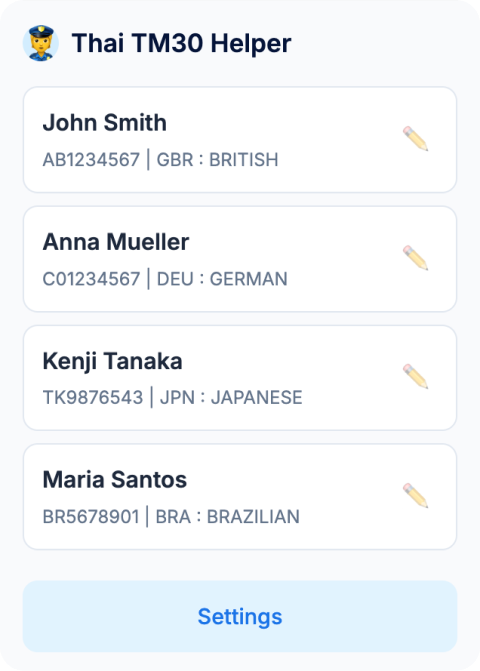

# 👮 Thai TM30 Helper

**Thai TM30 Helper** is a lightweight, privacy-focused Chrome extension designed to simplify the mandatory Notification of Residence for Foreigners (TM30) in Thailand. It automates the tedious task of filling out immigration forms by storing family/guest profiles and injecting them instantly into the official TM30 website.

## ✨ Features

- **Profile Management:** Store multiple family members or recurring guests for quick access.
- **Instant Auto-fill:** Single-click injection into the official TM30 web forms.
- **Excel Import/Export:** Export profiles to Excel for bulk TM30 submission via immigration's import feature.
- **Smart Mapping:** Automatically handles complex fields like Nationalities, Gender, and Dates.
- **Modern UI:** Clean, intuitive interface with a prioritized workflow.
- **🇹🇭 Thai language support.**
- **Privacy First:** All data is stored locally in your browser's storage. Nothing is sent to external servers or cloud services.

## 🚀 Installation

1. Visit the [Chrome Web Store](https://chrome.google.com/webstore) and search for **Thai TM30 Helper**.
2. Click **Add to Chrome**.
3. Confirm by clicking **Add extension** in the popup.
4. (Optional) Pin the extension: click the puzzle icon (🧩) in the toolbar, then click the pin icon next to **Thai TM30 Helper**.

## 📖 How to Use

### 1. Add Profiles

Click on the extension icon and select **Manage Profiles** (or go to the extension options). Add the details for the travelers you frequently report.

### 2. Fill Out the TM30 Form (Single Person)

1. Navigate to the [TM30 Search Page](https://tm30.immigration.go.th/tm30/#/external/ifa/search).
2. Click the **+ Add** button to open a new TM30 application form.
3. Click on the extension icon in your browser toolbar.
4. Select the profile of the person you want to report. If no profiles are available, see Step 1.
5. The form will be auto-filled with the selected profile data.
6. **Important:** Carefully review all auto-filled data, complete any remaining fields manually, and click **Save**.

### 3. Bulk TM30 Submission (Multiple Persons)

1. Go to the extension options page (**Manage Profiles**).
2. Scroll down to the **Import / Export** section.
3. Click **Export to Excel** to download an Excel file with all your profiles.
4. On the TM30 website, use the **Import Excel** feature to upload the file.
5. All persons will be submitted at once.

### 4. Verify Your Submission

1. Return to the [TM30 Search Page](https://tm30.immigration.go.th/tm30/#/external/ifa/search).
2. Click the **Search** button.
3. If successful, your TM30 submissions will appear in the table below.
4. Click the magnifying glass icon (🔍) on the desired row to view the details.
5. Click **Export** to download the PDF.

## 🔒 Privacy & Security

We take privacy seriously. This extension:
- **Does NOT** collect personal data.
- **Does NOT** use external APIs for tracking.
- **ONLY** interacts with the `tm30.immigration.go.th` domain.
- **STORES** all data locally via `chrome.storage.local`.

## 🛠 Tech Stack

- **Manifest V3** (Latest Chrome Extension Standard)
- **Vanilla JavaScript/HTML/CSS**

## 📄 License

This project is open-source. Feel free to contribute or adapt it for your needs.
